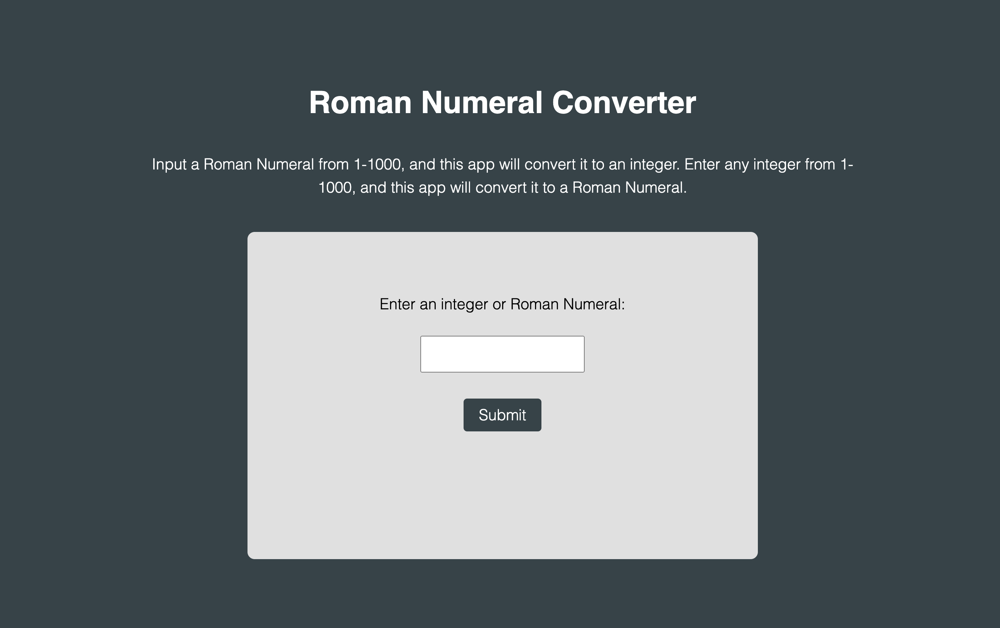

# Roman Numeral/Integer Converter

## Overview

This is a Next.js app that converts Roman Numerals to their respective integer values, and integers to their respective Roman Numerals. It currently works for numbers between 1-1000.

## Technologies Used

- Node.js
- Next.js

## Installation

This web application is deployed on Heroku: https://vruss14-roman-numerals.herokuapp.com/

Alternatively, the web application can be run in a local environment by cloning the repository, navigating to the correct folder, then running ```npm run dev``` to start the server. Open [http://localhost:3000](http://localhost:3000) with your browser to see the result.


## Usage

The webpage includes responsive design and can be viewed on all devices.

Below is a screenshot of the desktop version of the page:



## Credits

Valerie Russell was the sole contributor to this project. Contact her at vruss14@gmail.com.